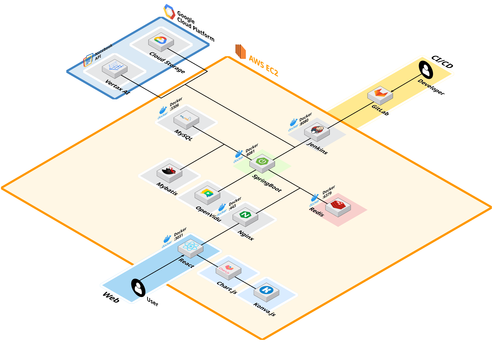
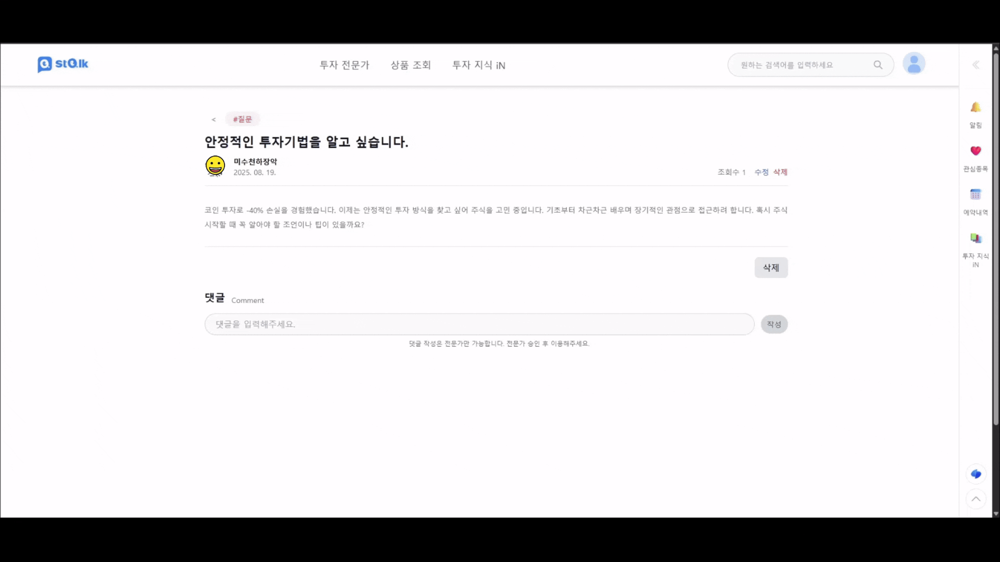

# README

# 📈 Stalk

## WebRTC 기반 화상 상담 차트 드로잉 서비스

> **Stalk**는 투자 전문가와 사용자가 실시간으로 차트를 보며 소통하는 WebRTC 기반의 화상 상담 서비스입니다. <br>기존의 온라인 강의나 증권사 리포트와 같은 일방향적인 정보 제공 방식의 한계를 극복하고, 개인 맞춤형 투자 상담을 제공하여 투자 지식을 더 똑똑하게 공유하고 성장하는 것을 목표로 합니다.

- **개발 기간** : 2025.07.07 ~ 2025.08.18 (7주)
- **플랫폼** : Web
- **개발 인원** : 6명

## 👥 팀원

| 이름          | 역할                                                 |
| ------------- | ---------------------------------------------------- |
| 김태윤 (팀장) | 백엔드, Infra, OpenVidu 화상 채팅                    |
| 김범주        | 프론트엔드, 차트 호출, 차트 그리기, 상품 조회        |
| 박민수        | 백엔드, 회원가입/로그인, 마이페이지, AI - GCP 구축   |
| 이상욱        | 프론트엔드, 회원가입/로그인, 마이페이지, 투자지식 iN |
| 정원준        | 백엔드, API 관리, 전문가 페이지, 결제                |
| 천광민        | 프론트엔드, UX/UI 담당, 홈페이지, 전문가 페이지      |

---

## 🧰 기술 스택

<div align="center">
  <!-- Core -->
  
  
  
  
  
  <br/>

  <!-- DevOps / Cloud -->
  
  
  
  
  
  <br/>

  <!-- Frontend -->
  
  
  
  
  
  
  
  <br/>

  <!-- Etc / Services -->
  
  
  
  
  
</div>

### 백엔드

- **언어**: Java 17
- **프레임워크**: Spring Boot 3.x
- **데이터베이스**: MySQL 8.0.x (InnoDB, utf8mb4)
- **ORM**: MyBatis
- **캐싱**: Redis 7.x (Refresh Token 저장소로 활용)
- **실시간 통신**: OpenVidu Server 2.30.0 (Docker Compose 기반 배포)
- **서버**: Nginx (Reverse Proxy, SSL 인증서 적용)
- **배포/CI/CD**: Docker, GitLab, Jenkins
- **클라우드**: AWS EC2, Google Cloud Platform (GCP), Google Vertex AI
- **외부 API**: 한국투자증권 API (KIS API), 한국거래소 API (KRX API), 토스페이먼츠 (Toss Payments), 구글 Vertex AI

### 프론트엔드

- **언어**: TypeScript
- **프레임워크**: React, Vite
- **상태 관리**: Recoil
- **스타일링**: Tailwind CSS
- **차트**: Chart.js (차트 호출 및 다양한 차트 구현)
- **드로잉**: Konva.js (차트 위 실시간 드로잉)
- **API 연동**: Axios

---

## **🌐** 시스템 구조도



---

## 🗃 시스템 아키텍처

Stalk 프로젝트는 마이크로 서비스 아키텍처를 기반으로 백엔드, 프론트엔드, AI 분석 서비스가 유기적으로 연동되는 구조입니다.

- **프론트엔드**: 사용자의 웹(React) 접근을 담당하며, Nginx를 통해 백엔드와 통신합니다.
- **백엔드**: SpringBoot 애플리케이션이 WAS를 포함하며, MySQL 및 Redis와 연동하여 서비스를 제공합니다. OpenVidu 서버는 WebRTC 기반의 실시간 화상 상담을 처리합니다.
- **AI 분석**: GCP의 Vertex AI와 Cloud Storage를 활용하여 상담 영상 분석 및 리포트 생성 기능을 확장성 있고 신뢰성 있게 제공합니다.
- **CI/CD**: GitLab과 Jenkins를 활용하여 개발 브랜치에서 테스트 서버로, 마스터 브랜치에서 운영 서버로 안정적인 배포를 자동화합니다.

---

## 🚀 빌드 및 배포 방법

### 1. 개발 환경

| 항목              | 내용                                                   |
| ----------------- | ------------------------------------------------------ |
| GitLab Repo       | `https://lab.ssafy.com/s13-webmobile1-sub1/S13P11E205` |
| Backend 디렉토리  | `Stalk_BE`                                             |
| Frontend 디렉토리 | `Stalk_FE`                                             |
| IDE               | IntelliJ IDEA 2023.3.8, VSCode                         |
| JDK/JVM           | OpenJDK 17.0.15                                        |
| Gradle            | 8.x (Wrapper 사용)                                     |
| Node.js           | v22.x~v23.x                                            |
| OS/배포 대상      | AWS EC2 Ubuntu 22.04 LTS                               |
| 형상관리          | GitLab                                                 |

### 2. 빌드

**Backend**

```bash
# GitLab 소스 클론
git clone https://lab.ssafy.com/s13-webmobile1-sub1/S13P11E205.git
cd S13P11E205/Stalk_BE
# Gradle 빌드 (Wrapper 사용)
./gradlew clean build -x test
# Docker 이미지 빌드
docker build -t stalk-be:latest .
```

**Frontend**

```bash
cd ../Stalk_FE
# 패키지 설치
npm install
# 빌드
npm run build
# Docker 이미지 빌드
docker build -t stalk-fe:latest .
```

### 3. 배포 (Docker)

**Backend**

```bash
docker run -d --name stalk-be --env-file .env -p 8081:8081 stalk-be:latest
```

**Frontend**

```bash
docker run -d --name stalk-fe -p 3000:80 stalk-fe:latest
```

_환경 변수 및 프로퍼티 설정은 `Stalk_BE/src/main/resources/application.properties` 및 `Stalk_FE/.env` 파일을 참조해야 합니다. Jenkins Secret File을 통해 환경 변수를 주입하는 방식이 사용됩니다._

---

## 📁 디렉토리 구조

- **Stalk_FE/**: Frontend (React) 프로젝트
  - `public/`: 정적 파일
  - `src/`: 소스 코드
    - `assets/`: 이미지, 아이콘 등 정적 리소스
    - `components/`: 재사용 가능한 UI 컴포넌트
    - `constants/`: 상수
    - `context/`: React Context
    - `hooks/`: 커스텀 훅
    - `pages/`: 페이지 컴포넌트
    - `services/`: API 호출 서비스
    - `types/`: 타입 정의
    - `utils/`: 유틸리티 함수
- **Stalk_BE/**: Backend (Spring Boot) 프로젝트
  - `src/main/java/`: Java 소스 코드
  - `src/main/resources/`: 설정 파일, Mybatis Mapper XML 등
  - `src/test/java/`: 테스트 코드
- **exec/**: 빌드 및 배포 관련 문서, DB 덤프 파일 등
- `docker-compose.{dev, prod}.yml`: Docker Compose 파일 (OpenVidu, MySQL, Redis, FE, BE 통합 관리)
- `Jenkinsfile`: Jenkins CI/CD 스크립트
- `nginx.conf`: Nginx 설정 파일

## ✨ 주요 기능

### 📈 주식 상품 조회, 관심종목 저장


<br>
실시간 주식 차트와 다양한 기술적 지표를 확인하고, 관심 종목은 저장할 수 있습니다.

---

### 🎥 화상 상담 서비스


<br>
WebRTC 기반의 양방향 화상 상담 기능을 제공합니다.  
실시간 차트 드로잉으로 직관적인 상담이 가능합니다.

---

### 🤖 AI 상담 요약 리포트


<br>
AI가 상담 내용을 분석하여 자동 요약 리포트를 생성합니다.

---

### 👤 투자 전문가 프로필 조회, 찜하기, 예약


<br>
전문가 프로필을 조회하고, 관심있는 전문가는 찜하고, 원하는 시간에 상담을 예약할 수 있습니다.

---

### 💬 투자 지식 iN (커뮤니티)


<br>
투자 관련 지식을 자유롭게 공유하고 토론할 수 있는 커뮤니티 공간입니다.
